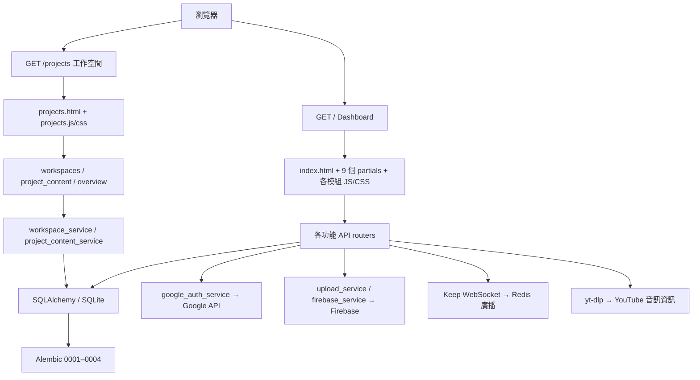

# FocusFlow：依功能頁拆解的架構與問題評估

日期：2026-09-16。依目前工作目錄程式碼盤點；本次沒有修改功能、資料庫或呼叫外部服務執行寫入。

## 最新補充：產品企劃執行

Today 快速新增、精確數量與載入更多、專案／回收桶 URL 狀態、CLI schema preflight、CI 設定已補。舊表格的相應缺口已部分解決；preflight 非所有啟動方式自動涵蓋，遠端 CI 尚未跑。詳見 PRODUCT_PLAN.md。

## 本批修復狀態（2026-09-16）

以下逐頁表格與問題段落保留審查時的證據；本節覆蓋已修復項目的舊狀態。

| 項目 | 最新狀態 |
|---|---|
| P1-1 Calendar update 缺失 | 已補 patch 端點與日期範圍驗證；儲存失敗保留表單 |
| P1-2 HTML 注入 | Calendar/Drive 動態內容改為 DOM；Tasks/Money/Music 尚待修 |
| P1-3 Drive 永久刪除 | 已改 trashed=True；UI 明示可在 Google Drive 還原 |
| P1-4 無界讀取 | Drive/Quiz 已共用 20 MB bounded upload；Quiz 加筆數／欄位預驗證 |
| P2-2 月界時區 | 後端使用 APP_TIMEZONE；前端顯示邊界、外部分頁與 Drive 跳脫仍待補 |
| P2-3 同步 I/O | Calendar 同步路由交由執行緒池；Drive 上傳遠端傳輸移入執行緒池；其他仍待整合 |
| P2-6 文件狀態混雜 | 五份 MD 已標明目前狀態與歷史；CI 等工程待辦未完成 |

本批沒有 migration 或雲端資料操作；provider 測試使用 mock，不宣稱真實 Google CRUD 已通過。

## 1. 結論

目前是「Dashboard 功能面板 + 新工作空間核心」的過渡架構。共用 CSS 已建立，但頁面生命週期、API 回應、資料歸屬、錯誤處理尚未統一。先修正既有頁面的功能缺口與資料保護，再逐頁抽離；不需要改成 React 或拆微服務。

**實際 HTML 路由只有 `/`、`/projects`。** 其他名稱是 `/` 內的面板，不是已有獨立網址的子網頁。下文建議網址均屬規劃。

## 2. 目前架構



共用樣式：`theme.css` 管理色彩與別名、`components.css` 管理部分控制項、`dashboard.css` 管理舊殼層。`ui.js` 提供安全 DOM 與 HTTP helper，但舊模組仍有自己的 fetch 與 HTML 組裝。

## 3. 每個功能頁的架構與缺口

表中的前端路徑以 `templates/partials/`、`static/js/` 為基準；各模組另有同名 CSS。

| 功能頁 | 頁面／JS | API／服務 | 資料來源與目前狀態 | 主要缺口與下一步 |
|---|---|---|---|---|
| 首頁／啟動器 | index.html、內嵌切頁程式 | main.py、auth | session；首頁另外讀 Note | 一次載入所有面板與腳本，多模組在 DOM ready 發 API；改成頁面入口與按需初始化 |
| 今日總覽 | projects.html、projects.js | overview/today | 本機 Task → Project → Workspace；各區最多 100 筆，UI 有 100+ | 尚未包括 Calendar 事件；加入明確統計總數與查看更多，不把截取數量當精確總數 |
| 工作空間／專案／課程 | projects.html、projects.js | workspaces、project_content；兩個 core service | Workspace、Project、Task、Note、ProjectLink；kind 區分 project/course | UI 狀態集中單一 JS、无專案深連結；檔案／事件仍缺 domain；先增加可還原的 URL 狀態 |
| Notes | notes.html、notes.js | notes；upload_service、firebase_service | 本機 Note；可編輯、選擇性掛專案、回收／還原 | 舊列表與回收桶未分頁；與專案頁兩套操作；共用 note 元件、分頁及草稿保留策略 |
| Drive | drive.html、drive.js | drive；google_auth_service | Google Drive，未建立本機 File 模型 | 永久刪除、無上傳上限、只取前 50 筆；先改回收桶及分頁，再做 Project FileRef |
| Calendar | calendar.html、calendar.js | calendar；google_auth_service | Google primary calendar，無本機 Event 關聯 | 前端編輯端點不存在；月界線以 UTC 建構；先補完整 edit contract 與台北跨月測試 |
| Tasks 看板 | tasks.html、tasks.js | tasks；google_auth_service | 第一個 Google tasklist；與本機 Task 完全獨立 | 日期／created_at 前後端不一致；列表未翻頁、錯誤變空清單；明確標示 Google 來源與修正資料契約 |
| Money | money.html、money.js | money；money_service | Transaction、Category | HTML 插值、Float 金額、輸入驗證弱；先修渲染／驗證，再設計最小貨幣單位 migration |
| Keep | chat.html、chat.js | chat、files；upload/Firebase，Redis 廣播 | KeepItem，已有分頁與安全 DOM，上傳回本機授權下載入口 | 未關聯 Project，也無轉成 Note／Task 流程；後續作收件匣，先定義內容轉換與重複提交保護 |
| Music | music.html、music.js | music；Google YouTube API、yt-dlp | MusicHistory + 外部內容 | 外部標題仍插 HTML；音訊擷取同步阻塞；保持獨立工具，補錯誤回退及限流，不納入核心資料樹 |
| Quiz | quiz.html、quiz.js | quiz | QuizBank、QuizQuestion、QuizOption、ExamSession、ExamAnswer | JSON 匯入無容量上限；沒有 Course 關聯；先限制匯入與補測試，再做課程題庫／錯題整理 |
| Settings／帳號 | settings.html、settings.js、index.html | auth、drive/storage | UserSession、localStorage 主題 | 清快取使用 localStorage.clear；設定頁混帳號／外部配額；改成明確偏好設定與連線狀態區 |
| 搜尋／匯出／回收桶 | projects.html、projects.js | overview/search、overview/export、notes/trash | 搜尋只覆蓋 Project/Task/Note；匯出 core+links | 匯出不是全系統備份，未含 Money/Keep/Quiz 或檔案本體；標示範圍，另建備份／還原流程 |

## 4. 確認的問題與優先級

P1：下一批應先修；P2：影響日常使用或維護；P3：後續演進。本次是原始碼審查，不宣稱每個風險均已完成瀏覽器攻擊重現。

### P1-1：Calendar「編輯」沒有後端端點
- `static/js/calendar.js` 的 submitEvent 在有 id 時送 `/api/calendar/update`；`routers/calendar.py` 僅有 events、add、delete。
- 同一段前端未檢查 response.ok，404 仍會關閉表單並刷新，造成看似已儲存的錯覺。
- 驗收：編輯成功後刷新仍保留；404/401/provider error 保留表單內容，顯示明確錯誤。

### P1-2：舊功能仍有 HTML 注入風險
- Calendar 的 e.summary、Tasks 的 t.content、Money 的 category/item/note、Drive 的 f.name 直接進入 innerHTML；Music 的 oEmbed title 也直接拼 HTML。
- 資料來源包含使用者輸入與外部內容；含標籤或引號的文字可能改變 DOM 或執行事件。Notes／Keep 修復不代表全站均安全。
- 驗收：以含標籤、引號、事件属性的測試字串驗證僅顯示文字；移除動態 inline onclick，改用 textContent 與事件綁定。

### P1-3：Drive 刪除為永久刪除
- `routers/drive.py` 的 delete_file 呼叫 `service.files().delete(...)`，不是設 trashed。
- 驗收：預設移到 Google 回收桶；若未來提供永久刪除，獨立呈現不可還原語意，不沿用一般刪除按钮。

### P1-4：上傳資源限制尚未覆蓋所有頁面
- Drive 的 `await file.read()` 直接建立 BytesIO；Quiz import 同樣整份讀入並 JSON decode，沒有本機容量／題目筆數限制。
- Notes／Keep 已使用 bounded_upload，但這兩處未接入。可能造成記憶體壓力與服務延遲。
- 驗收：在有限讀取時拒絕超限內容（413）；題庫另限制筆數、欄位長度、選項數；失敗不留下部分資料。

### P2-1：API 與畫面資料契約不一致
- Google Tasks 回傳沒有 created_at，前端卻顯示 t.created_at；日期用空格切分，但後端傳 Google due 原值。
- Google Tasks 例外回傳成功空陣列，容易誤判任務消失。Calendar／Money／Drive 多個寫入 fetch 未統一檢查 HTTP 狀態。
- 驗收：規範 response schema；401、無資料、外部服務失敗有不同 UI；失敗不清除草稿。

### P2-2：外部分頁、查詢與時區
- Drive 固定 pageSize=50，未回傳 nextPageToken；Calendar／Tasks 未循 nextPageToken。
- Drive 搜尋直接把 query 拼進 Google query 語法，帶單引號的檔名可能破壞查詢；這不是 SQL injection。
- Calendar 月初／月末用 naive datetime 加 Z，與 APP_TIMEZONE=Asia/Taipei 的日界不一致。
- 驗收：超過一頁仍可讀取；含引號搜尋可用；本地月初凌晨、月底晚間與全天事件有邊界測試。

### P2-3：router 邊界與效能
- 多個 async router 直接執行同步 Google SDK execute／yt-dlp 擷取；慢外部請求可能阻塞事件迴圈。
- overview 直接引用其他 router 的 dependency 與 schema。應將共用 dependencies/schemas 抽到穩定模組，避免 router 互依。
- 驗收：外部呼叫有 timeout、可辨識失敗；同步工作放入合適執行方式，並測試慢請求期間其他 API 仍能回應。

### P2-4：資料一致性與恢復能力
- Money amount/budget 用 Float，未定義幣別與小數規則；type/date/amount 缺少完整 domain validation。
- owner 仍以 email 為核心，尚無穩定 User ID；Quiz 多處關聯只存字串 id，未宣告 DB FK。
- core export 不含全站資料，備份 CLI 與還原演練需分開規劃。上次 missing-column 500 顯示啟動前 schema 檢查仍不足。
- 驗收：先備份與副本 migration；金額換算需核對舊值與捨入；加入 startup schema preflight，錯版提供明確診斷。

### P2-5：頁面隔離與 CSS 尚未全部收斂
- index 一次 include 全部 partial、載入全部功能 JS；全域變數與 onclick 還在，切頁不等於載入／卸載模組。
- 共用 theme/components 已建立，但局部 inline style、硬編色與特殊元件仍存在；前次 8 組檢查只覆蓋兩個頁面外殼，沒有驗證所有登入面板與彈窗。
- 驗收：每個面板測空白／有資料／錯誤／彈窗、明暗與手機版；逐頁採用共同 spacing/control token，保留播放鍵、日曆等專用形狀。

### P2-6：自動化與文件落後實作
- 目前 tests 有 migration、OAuth、core、legacy smoke；無 .github workflow。先前 41 項通過是歷史結果，本次沒有重跑全套。
- 新增 Today、links、trash、upload 等行為需要更具體的權限／失敗／容量測試。Dockerfile 存在，但本次未 build／驗證部署。
- V2_IMPLEMENTATION_PLAN 的前期章節仍寫「未升級原始 DB」，後文已記錄升級；應建立單一「目前狀態」，避免照過期敘述操作。

## 5. 建議的未來頁面架構（未實作）

```text
/                          今日首頁（整合 Today；保留舊 Dashboard 入口）
/workspaces                工作空間列表
/workspaces/{w}/projects/{p} 專案／課程總覽
  /tasks                   本機任務
  /notes                   筆記
  /files                   檔案引用
  /events                  行程引用
/notes                     跨專案筆記
/inbox                     Keep 收件匣
/calendar                  Google 日曆與專案關聯入口
/integrations/drive        Google Drive
/integrations/tasks        Google Tasks（清楚區別本機 Task）
/study                     題庫／測驗／學習紀錄
/money                     個人記帳
/music                     音樂工具
/settings                  偏好、帳號、外部連線、匯出／備份說明
```

先用 Jinja2 共用 base.html、navigation.html、controls 與 theme；逐頁加路由並重用現有 partial，保持舊入口可用。分頁與共用服務是兩件事，無須因為分頁就拆資料庫或微服務。

### 建議目錄責任

```text
templates/base.html + pages/ + partials/   共用殼層與頁面
static/css/theme.css + components.css     共用設計規則
static/css/{feature}.css                   只負責功能版面
static/js/core/                            HTTP、DOM、theme、頁面生命週期
static/js/pages/                           各頁初始化與互動
routers/pages.py + routers/{feature}.py    HTML／HTTP 邊界
schemas/ + dependencies.py                輸入輸出與授權依賴
services/                                 使用案例與 owner 驗證
integrations/                             Google、Firebase adapter
models/ + migrations/                     持久化規則
 tests/                                   API、權限、migration、頁面互動
```

這是目標責任劃分，應逐模組搬移，不一次改全站 import。

## 6. Domain 邊界

已實作：Workspace → Project(kind project/course) → Task；Note 可選 project_id；ProjectLink 存外部網址。

待設計：FileRef(project_id, provider, external_id, name, url) 與 EventRef(project_id, provider, calendar_id, external_id)。先保存引用與來源，不預設雙向同步；外部刪除／權限撤銷要顯示失效狀態。Google Tasks 與本機 Task 先明確分開；若日後同步，再設 mapping、方向、衝突及重試規則。

QuizBank 日後可選擇關聯 course project。Money／Music 保持使用者工具；Keep 作捕捉入口，提供可追溯的「轉為筆記／任務」，不用強制所有紀錄都掛 Project。

## 7. 分批落地與完成條件

1. **安全與既有功能**：Calendar edit、舊頁安全 DOM、Drive 回收桶、Drive/Quiz 上傳上限；新增各自回歸測試。
2. **契約與共用層**：統一 HTTP errors、auth dependency、schema、timezone；補外部分頁及 Google Tasks 日期顯示。
3. **逐頁拆分**：先 Notes → Calendar → Tasks，再 Drive／其他；每頁保留舊入口，驗證手機、明暗、鍵盤與表單失敗保留。
4. **核心關聯**：FileRef／EventRef、Course–QuizBank；只新增可空關聯及可回復 migration。
5. **交付品質**：schema preflight、備份還原演練、CI、Docker 持久化驗證、更新架構文件。以上穩定後再考慮進階搜尋與 GitHub，AI／換 DB 仍非當務之急。

本次證據界線：讀取本機程式碼與既有檢查結果；未重新測試真實 Google/Firebase/Redis/YouTube、未執行攻擊測試，未變更登入憑證或原始資料。

## 附錄：可定位的程式碼證據
- `main.py:84` — `@app.get("/"`
- `templates/index.html:76` — `include 'partials/music`
- `static/js/calendar.js:201` — `url = '/api/calendar/update'`
- `static/js/calendar.js:118` — `${e.summary}`
- `static/js/tasks.js:37` — `${t.content}`
- `static/js/tasks.js:40` — `${t.created_at}`
- `static/js/drive.js:89` — `title="${f.name}"`
- `static/js/money.js:76` — `${tx.item}`
- `routers/drive.py:72` — `service.files().delete`
- `routers/drive.py:62` — `await file.read()`
- `routers/quiz.py:271` — `raw = await file.read()`
- `routers/calendar.py:28` — `timeMin=`
- `routers/tasks.py:41` — `tasks_res =`
- `models/legacy.py:30` — `amount = Column(Float)`
- `routers/overview.py:40` — `def export`
- `static/js/settings.js:87` — `localStorage.clear`

## 本批驗證結果（2026-09-16）

- pytest：46 passed，148 warnings（既有日期／API deprecated 用法等仍待整理）。測試使用隔離 DB；Google provider 為 mock。
- 新測試涵蓋 Calendar patch／日期拒絕／錯誤不洩漏、Drive 移回收桶／超限拒絕與暫存清理、Quiz 匯入驗證失敗不寫入。
- Playwright：Calendar／Drive 的 HTML 測試字串不生成標籤、不執行事件；危險連結停用；Calendar 模擬 502 保留表單與內容。
- calendar.js、drive.js 的 Node 語法檢查通過。
- 無資料庫 migration、沒有操作真實 Google 雲端檔案或行程；未 commit/push。


## 2026-09-17 修復更新

本次實測發現的 Tasks/Money/Music HTML 注入、Tasks 500 清草稿、undefined 欄位已修復；Music 返回歌單已補、未完成的歌單寫入按鈕已明確停用。新增 serve.py、health/live、health/ready、Docker preflight 及瀏覽器 CI 回歸。詳細驗證與限制見 FIXES_2026_09_17.md。正式啟動使用 `python serve.py`，先依既有步驟備份及完成 migration；不能當作已完成公網部署。
